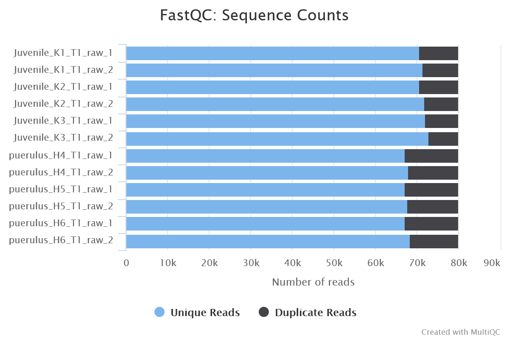
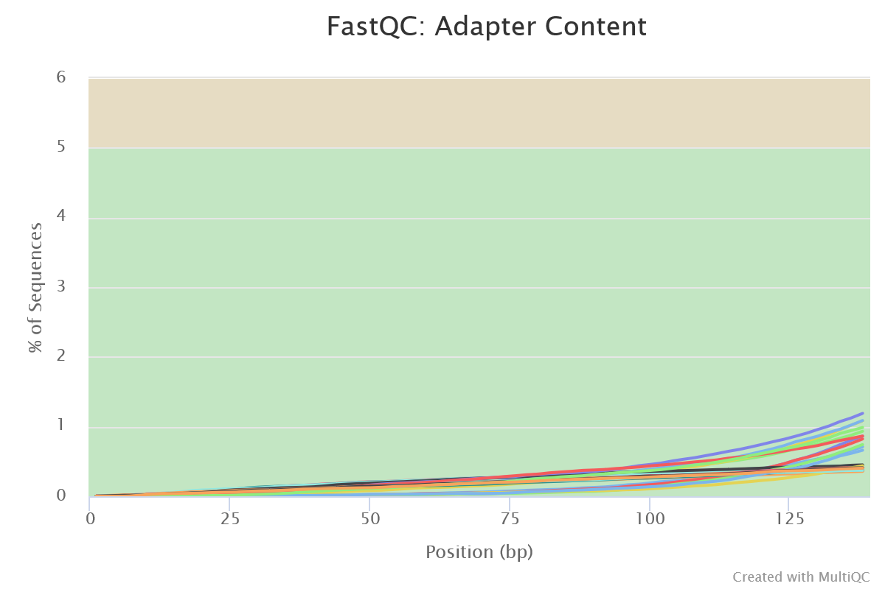
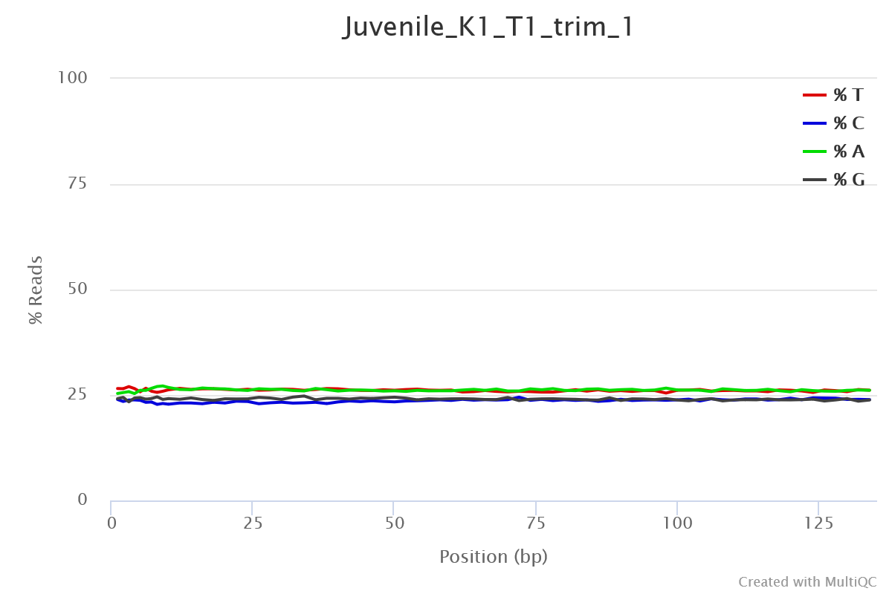
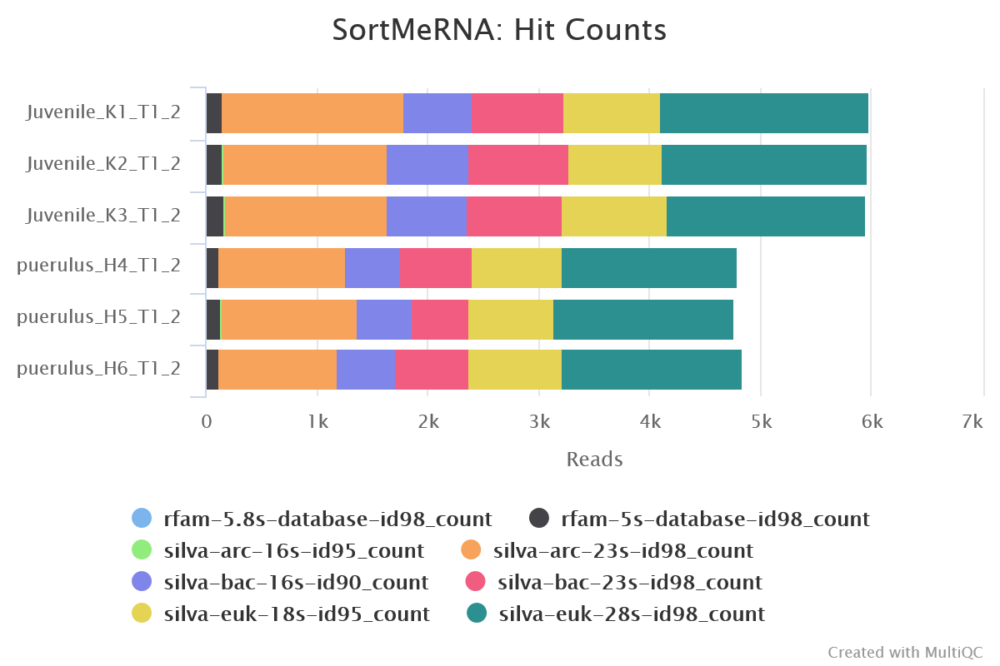
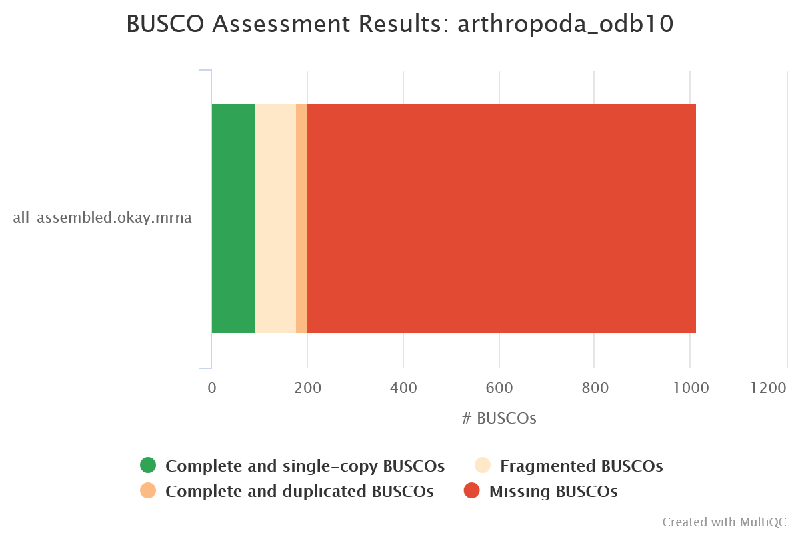
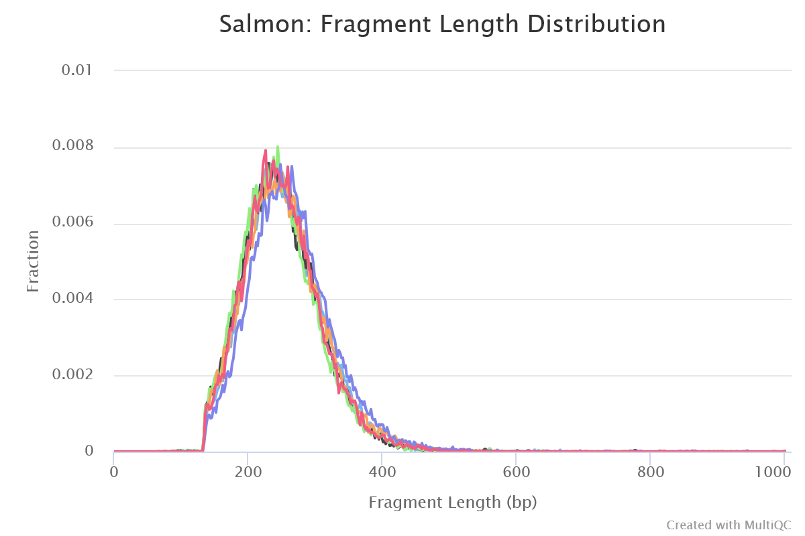
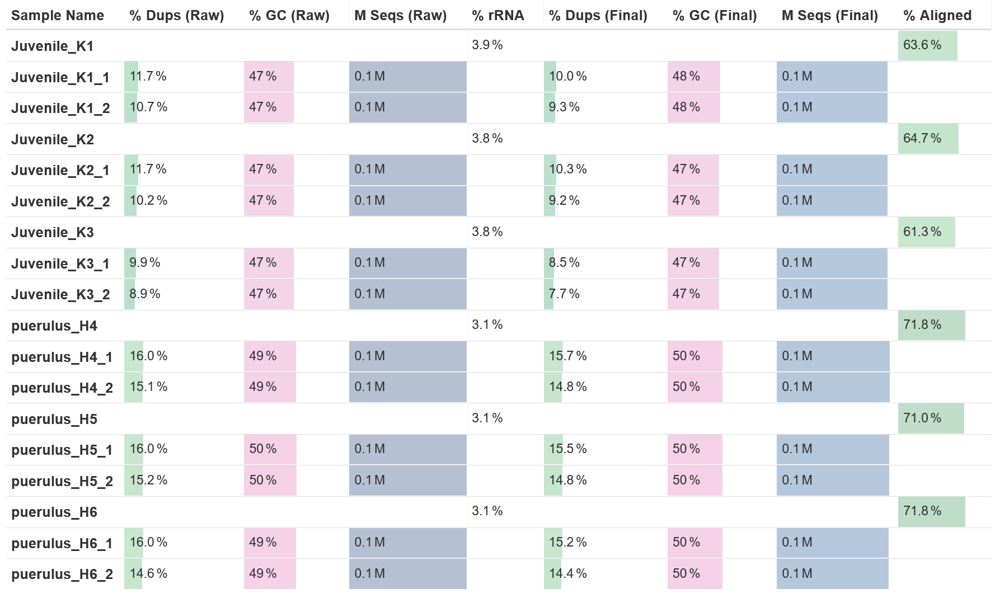

# nf-core/transfuse: Output

## Introduction

This document describes the output produced by the pipeline. Most of the plots are taken from the MultiQC report generated from the [full test dataset](https://github.com/nf-core/test-datasets/tree/denovotranscript) for the pipeline using a command similar to the one below:

```bash
nextflow run nf-core/denovotranscript \
  -profile test_full,singularity \
  --outdir <OUTDIR> \
  --extra_fastp_args='--trim_front1 15 --trim_front2 15' \
  --remove_ribo_rna \
  --save_non_ribo_reads \
  --busco_lineage= 'arthropoda_odb10'
```

The directories listed below will be created in the results directory after the pipeline has finished. All paths are relative to the top-level results directory.

## Pipeline overview

The pipeline is built using [Nextflow](https://www.nextflow.io/) and processes data using the following steps:

- [Pre-processing](#pre-processing)
  - [FastQC](#fastqc) - QC for raw reads, reads after trimming, and reads after removal of ribosomal RNA
  - [fastp](#fastp) - Adapter and quality trimming
  - [SortMeRNA](#sortmerna) - Removal of ribosomal RNA
- [Transcriptome assembly](#transcriptome-assembly)
  - [Cat](#cat) - Concatenate reads together before assembly
  - [Trinity](#trinity) - De novo transcript assembly
  - [rnaSPAdes](#rnaspades) - De novo transcript assembly
- [Redundancy reduction](#redundancy-reduction)
  - [EvidentialGene](#evidentialgene) - Redundancy reduction with tr2aacds
  - [tx2gene](#tx2gene) - Create a transcript to gene mapping file
- [Assembly quality assessment](#assembly-quality-assessment)
  - [BUSCO](#busco) - Benchmarking Universal Single-Copy Orthologs
  - [rnaQUAST](#rnaquast) - Transcriptome assembly quality assessment
  - [TransRate](#transrate) - Transcriptome assembly quality assessment
- [Quantification](#quantification)
  - [Salmon](#salmon) - Pseudo-alignment and quantification (transcript-level)
- [MultiQC](#multiqc) - Aggregate report describing results and QC from the whole pipeline
- [Pipeline information](#pipeline-information) - Report metrics generated during the workflow execution

## Pre-processing

### FastQC

<details markdown="1">
<summary>Output files</summary>

- `fastqc/raw`: For raw reads
  - `*_fastqc.html`: FastQC report containing quality metrics.
  - `*_fastqc.zip`: Zip archive containing the FastQC report, tab-delimited data file and plot images.
- `fastqc/trim`: For reads after trimming with fastp
  - `*_fastqc.html`: FastQC report containing quality metrics.
  - `*_fastqc.zip`: Zip archive containing the FastQC report, tab-delimited data file and plot images.
- `fastqc/final`: For reads after filtering out rRNA with SortMeRNA
  - `*_fastqc.html`: FastQC report containing quality metrics.
  - `*_fastqc.zip`: Zip archive containing the FastQC report, tab-delimited data file and plot images.

</details>

[FastQC](http://www.bioinformatics.babraham.ac.uk/projects/fastqc/) gives general quality metrics about your sequenced reads. It provides information about the quality score distribution across your reads, per base sequence content (%A/T/G/C), adapter contamination and overrepresented sequences. For further reading and documentation see the [FastQC help pages](http://www.bioinformatics.babraham.ac.uk/projects/fastqc/Help/).






> **NB:** The FastQC plots displayed in the MultiQC report shows _untrimmed_ reads. They may contain adapter sequence and potentially regions with low quality.

### fastp

<details markdown="1">
<summary>Output files</summary>

- `fastp/`
  - `*fastp.fastq.gz`: FastQ files of reads **after** trimming will be placed in this directory.
  - `*.fastp.html`: Trimming report in html format.
  - `*.fastp.json`: Trimming report in json format.
  - `*.fastp.log`: Trimming log file.
  - `*.fail.fastq.gz`: FastQ files of reads that failed trimming will be placed in this directory if the `--save_trimmed_fail` parameter is used.

</details>

[fastp](https://github.com/OpenGene/fastp) is a tool designed to provide fast, all-in-one preprocessing for FastQ files. It has been developed in C++ with multithreading support to achieve higher performance. fastp is used in this pipeline for standard adapter trimming and quality filtering. You can specify additional options for fastp via the `--extra_fastp_args` parameter.



### SortMeRNA

<details markdown="1">
<summary>Output files</summary>

- `sortmerna/`
  - `*.fastq.gz`: If `--save_non_ribo_reads` is specified, FastQ files containing non-rRNA reads will be placed in this directory.
  - `*.log`: Log file generated by SortMeRNA with information regarding reads that matched the reference database(s).

</details>

When `--remove_ribo_rna` is specified, the pipeline uses [SortMeRNA](https://github.com/biocore/sortmerna) for the removal of ribosomal RNA. By default, [rRNA databases](https://github.com/biocore/sortmerna/tree/master/data/rRNA_databases) defined in the SortMeRNA GitHub repo are used. You can see an example in the pipeline Github repository in `assets/rrna-default-dbs.txt` which is used by default via the `--ribo_database_manifest` parameter. Please note that commercial/non-academic entities require [`licensing for SILVA`](https://www.arb-silva.de/silva-license-information) for these default databases.



## Transcriptome assembly

### Cat

<details markdown="1">
<summary>Output files</summary>

- `cat/`
  - `pooled.merged.fastq.gz`: FastQ files after reads have been concatenated will be placed in this directory.
  - `all_assembled.fa.gz`: Transcripts from all assemblies concatenated into one file, before redundancy reduction.

</details>

The pipeline pools together pre-processed reads from all samples into one file for forward and one file for reverse reads. _De novo_ transcriptome assemblies are created using these pooled reads.

### Trinity

<details markdown="1">
<summary>Output files</summary>

- `trinity/`
  - `*.fa.gz`: de novo assembled transcripts fasta file compressed.
    This is produced if the `--trinity` and/or `--trinity_no_norm` parameter is used.
  - `pooled_reads.log`: Log file from trinity.

</details>

[Trinity](https://github.com/trinityrnaseq/trinityrnaseq/wiki) is used for efficient and robust _de novo_ reconstruction of transcriptomes from RNA-seq data.

### rnaSPAdes

<details markdown="1">
<summary>Output files</summary>

- `rnaspades/`
  - `*.assembly.gfa.gz`: Assembly graph in GFA format.
  - `*.transcripts.fasta`: Transcriptome assembly in FASTA format containing medium filtered transcripts. This is produced if the `--rnaspades` parameter is used (default=True).
  - `*soft_filtered_transcripts.fa.gz`: Transcriptome assembly in FASTA format containing soft filtered transcripts. This will only be used in the Evidential Gene step if both `--rnaspdes` and `--soft_filtered_transcripts` parameters are true.
  - `*hard_filtered_transcripts.fa.gz`: Transcriptome assembly in FASTA format containing hard filtered transcripts. These will only be used in the Evidential Gene step if both `--rnaspades` and `--soft_filtered_transcripts` parameters are true.
  - `*spades.log`: Log file from Spades.

</details>

[rnaSPAdes](https://ablab.github.io/spades/rna.html) is a tool that is primarily intended for assembling eukaryotic transcriptomes from short reads. However, it can also be utilized for assembling prokaryotic transcriptomes and meta-transcriptomes.

## Redundancy reduction

### EvidentialGene

<details markdown="1">
<summary>Output files</summary>

- `evigene/`
  - `dropset/`: Directory containing dropped transcripts and associated files.
  - `okayset/`: Directory containing included transcripts and associated files.
    The `*.okay.mrna` file in this directory contains mrna sequences for non-redundant transcripts. This is the final transcriptome assemly. The `*.okay.aa` file contains protein sequences for non-redundant transcripts.

</details>

[Evidential Gene's](http://arthropods.eugenes.org/EvidentialGene/) tr2aacds tool reduces redundancy by selecting the longest coding sequence, whilst preserving alternate and paralog transcripts that have a significant amount of unique sequence. It categorizes transcripts as either 'okay' or 'drop', separating those that are useful from those that are not.

### tx2gene

<details markdown="1">
<summary>Output files</summary>

- `tx2gene/`
  - `*tx2gene.tsv`: A tab-delimited file containing the transcript to gene mapping. The first column contains the transcript ID and the second column contains the gene ID.

</details>

The tx2gene mapping is created based on the `okayset/*.pubids` file generated by EvidentialGene.

## Assembly quality assessment

### BUSCO

<details markdown="1">
<summary>Output files</summary>

- `busco/`
  - `*-busco/`: Directory containing BUSCO lineage specific output
  - `short_summary*.json`: Short Busco summary in plain text format
  - `short_summary*.txt`: Short Busco summary in JSON format
  - `*batch_summary.txt`: Shorter summary of all sequence files analyzed

</details>

[BUSCO](https://busco.ezlab.org/) is a tool that assesses the completeness of genome assemblies, gene sets, and transcriptomes in terms of expected gene content. It uses lineage-specific sets of Benchmarking Universal Single-Copy Orthologs (BUSCOs) to provide quantitative measures of assembly quality.



### rnaQUAST

<details markdown="1">
<summary>Output files</summary>

- `rnaquast/`
  - `*_output/`: Directory containing detailed metrics (see example below)
  - `logs`: Directory containing log files
  - `short_report.pdf`: Summary report in PDF format
  - `short_report.tex`: Summary report in LaTeX format
  - `short_report.txt`: Summary report in plain text format
  - `short_report.tsv`: Summary report in TSV format

</details>

[rnaQUAST](https://github.com/ablab/rnaquast) is a tool for evaluating the quality of transcriptome assemblies using a reference genome and gene database. It can also produce reference-free metrics such as N50 and the number of transcripts > 1000bp.

```
# from rnaquast/*_output/basic_metrics.txt

METRICS/TRANSCRIPTS                                    all_assembled.okay.mrna
== BASIC TRANSCRIPTS METRICS (calculated without reference genome and gene database) ==
Transcripts                                            7542

Transcripts > 500 bp                                   4161
Transcripts > 1000 bp                                  1581

Average length of assembled transcripts                853.485
Longest transcript                                     27171
Total length                                           6436985

Transcript N50                                         1084
```

### TransRate

<details markdown="1">
<summary>Output files</summary>

- `transrate/`
  - `<assembly file basename>/`: Directory containing detailed metrics and associated files
  - `assemblies.csv`: CSV file containing summary metrics for assembly
  - `transrate.log`: log file showing command output from TransRate

</details>

[TransRate](https://hibberdlab.com/transrate/) can analyse assembly quality using evidence from sequencing reads and provides quality scores for contigs and assemblies.


```
# from transrate.log

Read mapping metrics:
-----------------------------------
fragments                    440655
fragments mapped             305702
p fragments mapped             0.69
good mappings                285522
p good mapping                 0.65
bad mappings                  20180
potential bridges               168
bases uncovered              769015
p bases uncovered              0.12
contigs uncovbase              2840
p contigs uncovbase            0.38
contigs uncovered               743
p contigs uncovered             0.1
contigs lowcovered             6780
p contigs lowcovered            0.9
contigs segmented               183
p contigs segmented            0.02
Read metrics done in 54 seconds
No reference provided, skipping comparative diagnostics
TRANSRATE ASSEMBLY SCORE     0.3126
-----------------------------------
TRANSRATE OPTIMAL SCORE      0.4516
TRANSRATE OPTIMAL CUTOFF     0.0624
good contigs                   6897
p good contigs                 0.91
```

## Quantification

### Salmon

<details markdown="1">
<summary>Output files</summary>

- `salmon/`
  - `<SAMPLE>/`
    - `aux_info/`: Auxiliary info e.g. versions and number of mapped reads.
    - `cmd_info.json`: Information about the Salmon quantification command, version and options.
    - `lib_format_counts.json`: Number of fragments assigned, unassigned and incompatible.
    - `libParams/`: Contains the file `flenDist.txt` for the fragment length distribution.
    - `logs/`: Contains the file `salmon_quant.log` giving a record of Salmon's quantification.
    - `quant.sf`: Salmon _transcript_-level quantification of the sample, including feature length, effective length, TPM, and number of reads.
- `*lib_format_counts.json`: Contains information about the library format that was inferred.
- `*meta_info.json`: Meta information from Salmon quant such as version and options used.

</details>

[Salmon](https://combine-lab.github.io/salmon/) is a tool for quantifying the expression of transcripts using RNA-seq data. It uses a quasi-mapping-based approach to provide fast and accurate quantification.



## MultiQC

<details markdown="1">
<summary>Output files</summary>

- `multiqc/`
  - `multiqc_report.html`: a standalone HTML file that can be viewed in your web browser.
  - `multiqc_data/`: directory containing parsed statistics from the different tools used in the pipeline.
  - `multiqc_plots/`: directory containing static images from the report in various formats.

</details>

[MultiQC](http://multiqc.info) is a visualization tool that generates a single HTML report summarising all samples in your project. Most of the pipeline QC results are visualised in the report and further statistics are available in the report data directory.

Results generated by MultiQC collate pipeline QC from supported tools e.g. FastQC. The pipeline has special steps which also allow the software versions to be reported in the MultiQC output for future traceability. For more information about how to use MultiQC reports, see <http://multiqc.info>.



## Pipeline information

<details markdown="1">
<summary>Output files</summary>

- `pipeline_info/`
  - Reports generated by Nextflow: `execution_report.html`, `execution_timeline.html`, `execution_trace.txt` and `pipeline_dag.dot`/`pipeline_dag.svg`.
  - Reports generated by the pipeline: `pipeline_report.html`, `pipeline_report.txt` and `software_versions.yml`. The `pipeline_report*` files will only be present if the `--email` / `--email_on_fail` parameter's are used when running the pipeline.
  - Reformatted samplesheet files used as input to the pipeline: `samplesheet.valid.csv`.
  - Parameters used by the pipeline run: `params.json`.

</details>

[Nextflow](https://www.nextflow.io/docs/latest/tracing.html) provides excellent functionality for generating various reports relevant to the running and execution of the pipeline. This will allow you to troubleshoot errors with the running of the pipeline, and also provide you with other information such as launch commands, run times and resource usage.
